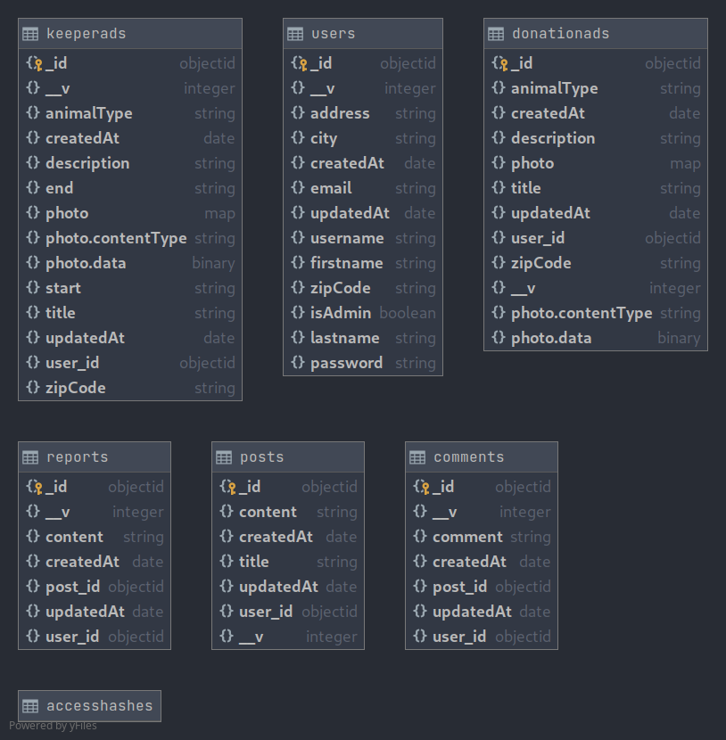

# C-COD-260-PAR-2-1-ecp-estelle.thou

## Presentation 

"Pet My Pets" is a website for animal donation or people who are looking for keepers. 
Every visitors can : 
- See all doantion or keeper ads
- Find veterinarians near by 
- Read animal topics on the Forum section 

After subscription, users can :
- Create, update or delete their ads. 
- Manage all their ads through their profile dashboard 
- Discuss on the Forum section 

If you are admin, you have controlled on everything :
- CRUD Users, Donation & Keeper ads, Posts etc


## Stack : MERN
- DB :  Mongo DB Atlas
- Front : React JS 
- Back : Express JS 
- Deployment : Heroku, Docker 

DB UML Model : 


## Installation for local usage 

In /client/package.json, change the proxy (server running on PORT 4000) :  
`"proxy": "http://localhost:4000/api/";`

In /client/src/App.js use :
`axios.defaults.baseURL = 'http://localhost:4000/api/';`

At the root of the project where there is the dev-docker-compose.yml file, run the command :
`docker-compose -f dev-docker-compose.yml up --build`

This command runs client (PORT 3000) and server (PORT 4000) together.

To quit docker run :
Ctrl + C

## Installation for remote usage (Heroku)
### Backend on Heroku
If you want to deploy your back create an Heroku account, new app and for the deployment follow these steps:
```
$ heroku login
$ heroku git:clone -a < name-of-my-back-app >
cd server
$ git add . (BE CAREFUL, DON'T PUSH YOUR .env)
$ git commit -am "make it better"
$ git push heroku master
```

Then, in your dashboard Heroku, go to Settings and add all your .env variable :
```
GOOGLE_API_KEY 
GOOGLE_PASSWORD
GOOGLE_USER
JWT_SECRET
MONGO_URI
```

### Frontend on Heroku
In your /client rename your `package.json` to `package-local.json.`
And change  `package-heroku.json.` `to package.json`. 
In /client/src/App.js use :
`axios.defaults.baseURL = 'https://<name-of-my-backend-app>.herokuapp.com/api/'`;

If you want to deploy your front create a new app and for the deployment follow these steps:
```
$ heroku login
$ heroku git:clone -a < name-of-my-front-app >
cd client
$ git add . (BE CAREFUL, DON'T PUSH YOUR .env)
$ git commit -am "make it better"
$ git push heroku master
```

Then, in your dashboard Heroku, go to Settings and add all your .env variable :
`GOOGLE_API_KEY`


