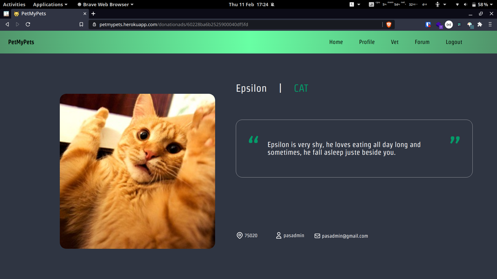

# Pet my Pets
# User Manual

## User 
### Register/Login

   Even though the first page you will land on when accessing https://petmypets.herokuapp.com, we recommend you to first go to the *SignUp* page, where you will be able to create an account and access the full features of our website.
   
   
   
   To do so, just click on the *SignUp* link in the navigation bar. Enter the asked informations, and you will now have an account on our website. The next time, you'll only have to enter your email and password in the *SignIn* page, where you can also reset your password. 
   
   

### Home page

Lets look around the home page now, which is the center of the website. It is where the ads for keeping an animal, or adopting one are displayed. The focus is made on the *Donations*, the adoption page. 

 

#### Donations
  
You can see the name and type of each animals, the zip code of the donor and his username, and of course a picture of the cutie. Click on the card, and you will access it's page, where a description is accessible, as well as the email of the donor, if you want to contact him to adopt the cutie (of course you want to, who wouldn't ?).

 

#### Keeper
 
The keeper tabs is mainly the same, except you have now the duration of the keeping, so you can adopt the cutie for a limited time only, without the disagreement of a life-long adoption, in case you want some free hugs during a hard week, or just want to be a great human being which doesn't like to see an animal alone in a flat.
On the top of the page, the search bar let you type informations, as an animal type, to filter the ads.

When connected, you can also create an ad yourself, by clicking the **+** sign, in the top left. Enter the asked informations, put the best picture of your animal and the ad is now ready ! 

Be sure to be on the correct page to create the ad, for you can't change it's type later (donation or keeper). 
When accessing your own ad, you can now delete it, or change some of it's informations.
 

### Profile
The profile tab is where you can access your informations and change them, as well as having an overlook on all your ads of each types.

### Veterinary
> There's 3 sexy veterinaries near your location

This tab is another feature of our website : you can quickly access a map for your location or any given one, and look for veterinary in the area so don't have to google it. We value your time !
### Forum
Here, you can look for posts of people and have a discussion with them. You can filter the posts in the same way as in the home page, and create one if you have a question or want to start a heated argument on a topic.
When clicking on a post in the left menu, it will appear in the general view, and you can edit it or delete it if it's your. Noticed the (!) sign ? This is when things goes south and the argument becomes way too heated. By clicking it, you will be asked why do you want to report this post, and it will be send to an admin for moderation. 
You can aswell comment a post to answer someone, and of course edit and delete your own comment. 

### LogOut
The last link is the *LogOut* link, which will ... log you out, of course. Do this when you are finished with your visit of the website.

## Admin
When login in as an admin, you will go to a different type of website : the admin panel. You will have here the same capabilities as a general user, but with benefits. 
This dashboard lets you create, edit and delete everything, like a user, but also edit and delete other users ads, posts and comments (for moderation purpose only, of course). You can access the reported posts of the forum too, and see if they need to be changed/deleted or not. Be very carefull, a lot of power is in your hands, so use it accordingly !
